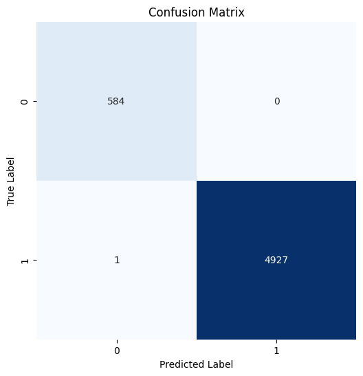
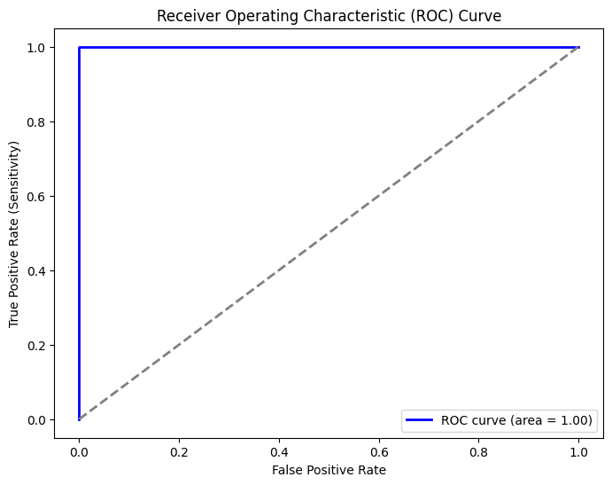

# Property Sales Data Classification

This project aims to classify property sales as either **Residential** or **Commercial** using machine learning and deep learning techniques. The dataset spans property sales from 2002 to 2018 and includes various attributes such as property type, address, style, sale date, and more.

## Table of Contents

- [Property Sales Data Classification](#property-sales-data-classification)
  - [Table of Contents](#table-of-contents)
  - [Project Overview](#project-overview)
  - [Data Description](#data-description)
  - [Data Preprocessing](#data-preprocessing)
  - [Feature Engineering](#feature-engineering)
  - [Model Building and Training](#model-building-and-training)
    - [Feature Importance Analysis](#feature-importance-analysis)
    - [Neural Network Model](#neural-network-model)
  - [Evaluation and Results](#evaluation-and-results)
    - [Plots](#plots)

## Project Overview

The goal of this project is to develop a classification model that can distinguish between Residential and Commercial property sales. The approach involves:
- **Data Cleaning and Preprocessing:** Handling missing values, filtering data, and normalizing features.
- **Feature Engineering:** Creating new features from existing data (e.g., engineered address features, style recoding, date features) and applying one-hot encoding.
- **Model Building:** 
  - First, a Random Forest classifier is used to assess feature importances.
  - Then, a Neural Network (built with Keras) is trained to perform the binary classification.
- **Model Evaluation:** Assessing performance via accuracy, confusion matrix, and ROC curve.

## Data Description

The dataset is stored in the CSV file: `2002-2018-property-sales-data.csv`. Key columns include:

- **PropType:** Property type (Residential, Condominium, Commercial, etc.)
- **Taxkey:** Unique property identifier.
- **Address:** Property address.
- **CondoProject:** Condo project details (*many missing values*).
- **District:** District code.
- **Nbhd:** Neighborhood code.
- **Style:** Architectural style.
- **Extwall:** External wall details (*contains missing values*).
- **Stories:** Number of stories.
- **Year_Built:** Year the property was built.
- **Nr_of_rms:** Number of rooms.
- **Fin_sqft:** Finished square footage.
- **Units:** Number of units.
- **Bdrms:** Number of bedrooms.
- **Fbath:** Number of full bathrooms.
- **Hbath:** Number of half bathrooms.
- **Lotsize:** Lot size.
- **Sale_date:** Date of sale.
- **Sale_price:** Sale price.

## Data Preprocessing

The following preprocessing steps are performed:

1. **Missing Value Handling:**
   - Dropped the columns `CondoProject` and `Extwall` due to high missing rates.
   - Removed any remaining rows with missing data.

2. **Filtering and Encoding:**
   - Filtered the dataset to keep only records where `PropType` is "Residential" or "Commercial".
   - Converted `PropType` into a binary label:  
     - `1` for **Residential**  
     - `0` for **Commercial**

3. **Date Handling:**
   - Converted the `Sale_date` column to datetime format.
   - Extracted `sale_year` and `sale_month` as separate features.
   
4. **Scaling:**
   - Applied a MinMaxScaler to normalize all feature values.

## Feature Engineering

Several feature engineering techniques were applied:

- **Address Engineering:**
  - Extracted the last two characters of the `Address` column to create a new feature (`Address_engineered`).
  - Replaced specific address codes (e.g., `"L "`, `"Y "`, `"WA"`, `"CR"`, `"TR"`, `"LA"`) with a common label `"not_common_address"`.
  - Applied one-hot encoding to this engineered feature.

- **Style Engineering:**
  - Identified the top 5 property styles (`"Ranch"`, `"Cape Cod"`, `"Residence O/S"`, `"Milwaukee Bungalow"`, `"Colonial"`).
  - All other styles were recoded as `"not_common_style"`.
  - Applied one-hot encoding to the `Style` feature.

After encoding, the original `Address`, `Address_engineered`, and `Style` columns were removed and replaced with their one-hot encoded counterparts.

## Model Building and Training

### Feature Importance Analysis

- A **Random Forest Classifier** was initially trained to determine the importance of features.
- Based on the feature importances, the following features were dropped:  
  - `"Milwaukee Bungalow"`, `"PK"`, `"Nr_of_rms"`, `"CT"`, `"not_common_address"`

### Neural Network Model

A neural network was built using Keras with the following architecture:

- **Input Layer:** Matches the number of features after preprocessing.
- **Hidden Layers:**
  - First hidden layer with 64 neurons (ReLU activation).
  - Second hidden layer with 32 neurons (ReLU activation).
- **Output Layer:** Single neuron with Sigmoid activation (for binary classification).

The model was compiled with the Adam optimizer and binary crossentropy loss. Early stopping was implemented to prevent overfitting, and class weights were computed to address class imbalance.

The training process includes:
- Splitting the data into training (80%) and test (20%) sets with stratification.
- Using a validation split during training.
- Saving the best model to `best_model.keras`.

## Evaluation and Results

The saved model is evaluated on the test set, with key metrics including **test loss** and **test accuracy**.

- Test loss: 0.000667207408696413
- Test accuracy: 0.9998185634613037

Additionally, performance is visualized using:

- **Confusion Matrix:** Provides insight into true vs. predicted classifications.
- **ROC Curve:** Displays the trade-off between true positive rate and false positive rate.

### Plots

- **Confusion Matrix Plot:**  
  

- **ROC Curve Plot:**  
  

